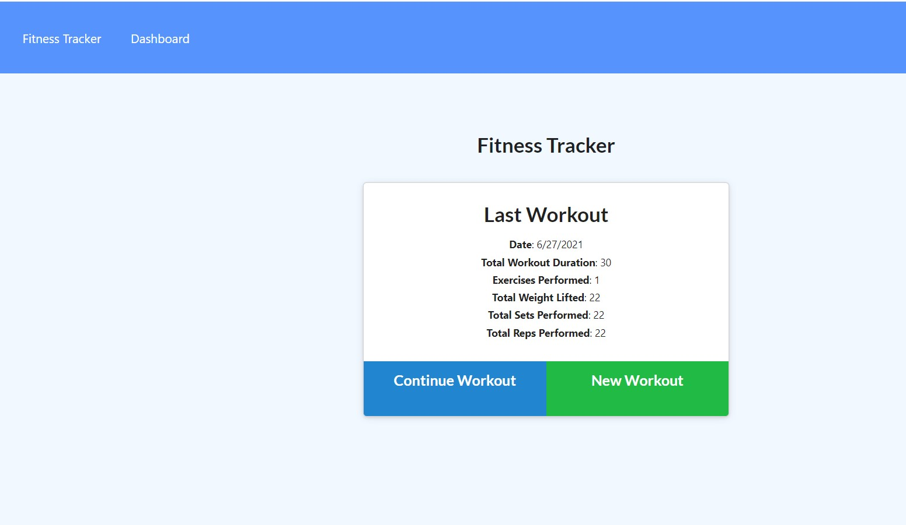
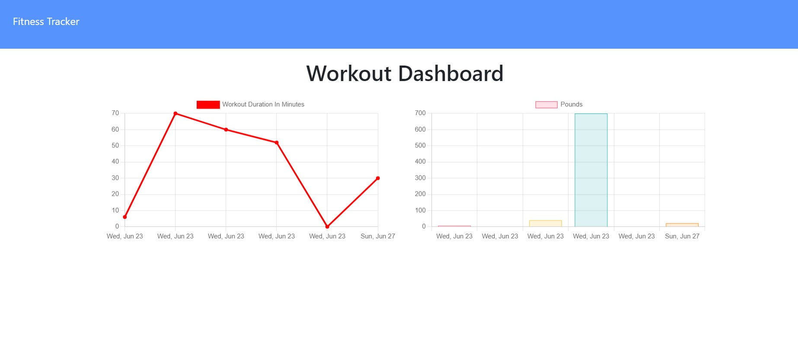
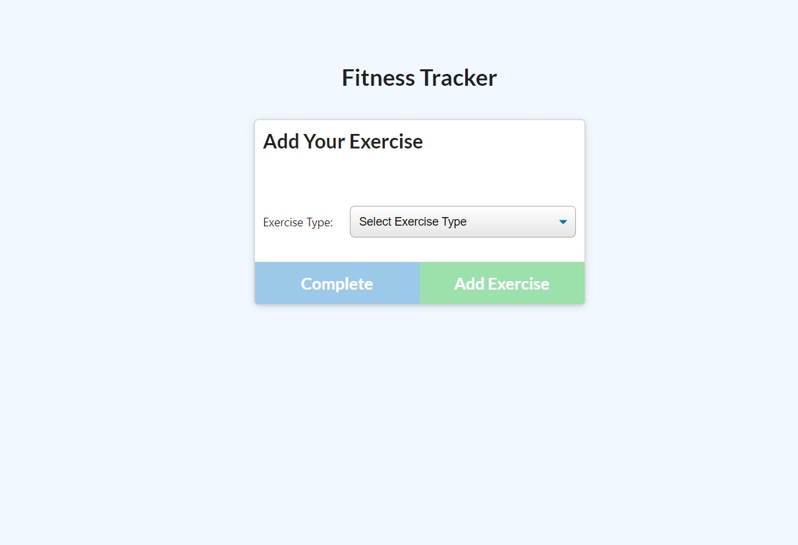
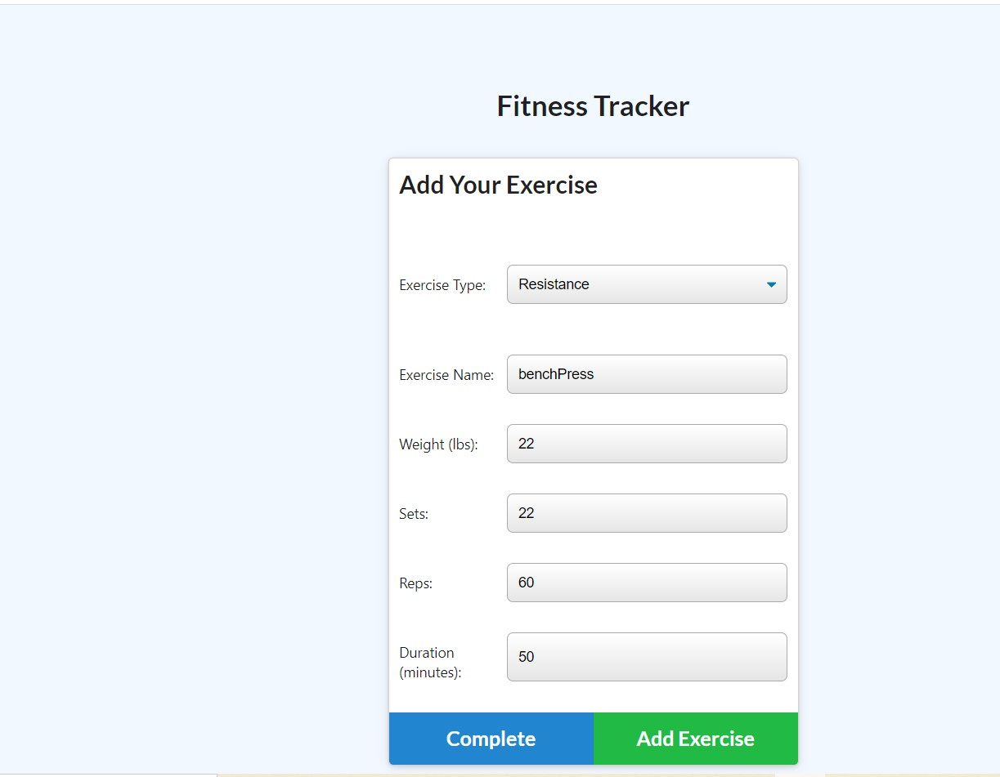

# Fitness-Tracker
## License
 [](https://opensource.org/licenses/MIT)

## Description
```
This workout tracker  app will help you to keep track of your fitness goal.
```
## Deployed Link

Heroku Link: <br  />
https://guarded-hollows-80756.herokuapp.com/ <br  />
Github Link: <br  />
 https://github.com/shaimajobran/Fitness-Tracker<br  />


## User story
```
As a user, 
I want to be able to view create and track daily workouts. 
I want to be able to log multiple exercises in a workout on a given day. 
I should also be able to track the name, type, weight, sets, reps, and duration of exercise. 
If the exercise is a cardio exercise, I should be able to track my distance traveled.
```
## Acceptance Criteria
```
When the user loads the page, they should be given the option to create a new workout 
or continue with their last workout.

The user should be able to:

Add exercises to the most recent workout plan.

Add new exercises to a new workout plan.

View the combined weight of multiple exercises from the past seven workouts on the `stats` page.

View the total duration of each workout from the past seven workouts on the `stats` page.
```
 ## SCREEN SHOTS





## Contact
If you have any questions about the repo, contact me at [shaimajobran](shaimajobran22@gmail.com).


